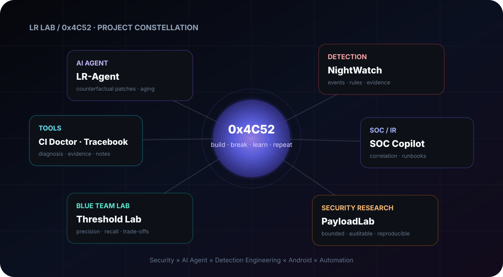

<div align="center">


# ◈ LR / LLR6

### 把好奇心写进代码，把工程结果留给复现。

`Security` · `AI Agent` · `Android` · `Automation`

[](https://github.com/LLR6/Cybersecurity-Detection-Engineering-Android-Automation-Learning-by-Building)
[](https://github.com/LLR6/LR-agent)
[](https://github.com/LLR6/LR-Tablet)

**◉ SYSTEM ONLINE　｜　build · break · learn · repeat**

</div>

---

<!-- LR-NOW-BUILDING:START -->

## ⌁ Now Building

<table>
<tr>
<td width="25%" valign="top">

### ⏳ Agent Reliability
**LR-Agent**

Counterfactual patches, causal evidence, repository aging.

[Open →](https://github.com/LLR6/LR-agent)

</td>
<td width="25%" valign="top">

### 📡 Detection
**NightWatch**

Sequence correlation, beaconing, DNS signals, evidence-backed alerts.

[Open →](https://github.com/LLR6/Cybersecurity-Detection-Engineering-Android-Automation-Learning-by-Building)

</td>
<td width="25%" valign="top">

### 🧭 SOC / IR
**LR-SOC-Copilot**

Entity correlation, local runbooks, source-line citations.

[Open →](https://github.com/LLR6/LR-SOC-Copilot)

</td>
<td width="25%" valign="top">

### 📱 Android
**LR-Tablet**

Tablet-first reading practice, local progress, reproducible APK builds.

[Open →](https://github.com/LLR6/LR-Tablet)

</td>
</tr>
</table>

<p align="center">
  
  
  
  
</p>

<!-- LR-NOW-BUILDING:END -->


## ✦ Featured

<table>
<tr>
<td width="50%" valign="top">

### ⏳ [LR-Agent](https://github.com/LLR6/LR-agent)

**What if a patch passes today but breaks after the repository evolves?**

A local coding-agent research lab for counterfactual patches, evidence-driven strategy validation and multi-generation repository aging.

[](https://github.com/LLR6/LR-agent/stargazers)
[](https://github.com/LLR6/LR-agent/actions)

→ [See the demo](https://github.com/LLR6/LR-agent#readme)

</td>
<td width="50%" valign="top">

### 📡 [Detection Threshold Lab](https://github.com/LLR6/lr-detection-lab)

**See what a detection threshold really costs.**

A reproducible blue-team experiment for beacon detection: labeled synthetic traffic, threshold sweeps, confusion matrices and per-flow evidence.

[](https://github.com/LLR6/lr-detection-lab/stargazers)
[](https://github.com/LLR6/lr-detection-lab/actions)

→ [Run the 1-minute demo](https://github.com/LLR6/lr-detection-lab#readme)

</td>
</tr>
</table>

> 最近主要在做两个问题：**Agent 的长期可靠性**，以及 **Detection Engineering 里阈值、证据和误报之间的关系**。


<!-- LR-PROJECT-MAP:START -->

<!-- LR-ENGINEERING-HEALTH:START -->
## ◫ Engineering Health

<p align="center">
  <a href="./ENGINEERING_HEALTH.md"></a>
</p>

这里不只展示“做了什么”，也记录每个项目有没有 **测试、固定评估集、CI Artifact、完整性/溯源信息，以及明确的限制条件**。

→ [Open the engineering health matrix](./ENGINEERING_HEALTH.md)

<!-- LR-ENGINEERING-HEALTH:END -->


## ◇ Project Constellation

<!-- LR-CONSTELLATION-ART:START -->
<p align="center"></p>
<!-- LR-CONSTELLATION-ART:END -->


<p align="center">
  <a href="https://github.com/LLR6/LR-agent"></a>
  <a href="https://github.com/LLR6/Cybersecurity-Detection-Engineering-Android-Automation-Learning-by-Building"></a>
  <a href="https://github.com/LLR6/LR-SOC-Copilot"></a>
  <a href="https://github.com/LLR6/LR-Tablet"></a>
</p>

| Track | Repositories | Focus |
|---|---|---|
| **AI Agent** | [LR-Agent](https://github.com/LLR6/LR-agent) | counterfactual patches · evidence · long-horizon reliability |
| **Detection** | [NightWatch](https://github.com/LLR6/Cybersecurity-Detection-Engineering-Android-Automation-Learning-by-Building) · [Threshold Lab](https://github.com/LLR6/lr-detection-lab) | event correlation · beaconing · thresholds · evidence |
| **Security × AI** | [SOC Copilot](https://github.com/LLR6/LR-SOC-Copilot) · [Detector Resilience](https://github.com/LLR6/LR-Detector-Resilience-Lab) · [PayloadLab](https://github.com/LLR6/LR-PayloadLab) | investigation · drift · telemetry validation |
| **Tools** | [Android CI Doctor](https://github.com/LLR6/lr-android-ci-doctor) · [CTF Tracebook](https://github.com/LLR6/lr-ctf-tracebook) | build diagnosis · reproducible notes |
| **Android / Learning** | [LR-Tablet](https://github.com/LLR6/LR-Tablet) | local-first learning workflow |

<p align="center">
  
  
  
</p>

<!-- LR-PROJECT-MAP:END -->


## 你好，我是 LR 👋

平时主要折腾网络安全、AI Agent、Android 和各种自己真正会用到的小工具。

我喜欢把一个想法从“能跑”继续做到“能测、能复现、能解释为什么这样设计”。这里放着一些安全实验、Agent 原型、学习工具和日常工程项目，也会记录踩坑、重构和偶尔冒出来的新点子。

> 最近比较感兴趣的是 **检测工程、Agent 可靠性、自动化和本地优先的软件体验**。

### 🛰️ Projects

| 项目 | 简介 | 入口 |
| :--- | :--- | :--- |
| **[NightWatch](https://github.com/LLR6/Cybersecurity-Detection-Engineering-Android-Automation-Learning-by-Building)** | 本地安全事件关联与检测实验：登录序列、端口扇出、周期外联、DNS 异常与证据输出 | [README](https://github.com/LLR6/Cybersecurity-Detection-Engineering-Android-Automation-Learning-by-Building#readme) |
| **[LR-agent](https://github.com/LLR6/LR-agent)** | 可操作工作区的 Agent 实验台：任务执行、工具调用、验证、策略对比与隔离工作区 | [README](https://github.com/LLR6/LR-agent#readme) |
| **[LR-Tablet](https://github.com/LLR6/LR-Tablet)** | 面向横屏平板的阅读训练器：双栏阅读、导入、作答、批注与本地记录 | [README](https://github.com/LLR6/LR-Tablet#readme) |
| **[LR Lab](https://github.com/LLR6/-)** | Android、本地工具、安全实验和一些奇怪想法的集合 | [项目索引](https://github.com/LLR6/-#readme) |

### 🛡️ Security × AI

| 项目 | 在做什么 |
| :--- | :--- |
| **[LR-PayloadLab](https://github.com/LLR6/LR-PayloadLab)** | 受限、可审计的端点遥测实验：行为声明、策略边界、回执与清理 |
| **[Detector Resilience Lab](https://github.com/LLR6/LR-Detector-Resilience-Lab)** | 在不可执行数值特征上研究检测模型面对分布漂移时的退化、翻转样本与特征变化 |
| **[LR-SOC-Copilot](https://github.com/LLR6/LR-SOC-Copilot)** | 按实体和时间关联告警，检索本地 Runbook，并为调查摘要保留源行证据 |

这几个项目互相有一点联系：从产生可观察行为，到检测、关联，再到分析检测为什么会失效。

### 🧰 Small Tools

| 工具 | 用途 |
| :--- | :--- |
| **[Android CI Doctor](https://github.com/LLR6/lr-android-ci-doctor)** | 从 Gradle / Android CI 日志里快速找构建、签名、JDK、SDK 和产物问题 |
| **[CTF Tracebook](https://github.com/LLR6/lr-ctf-tracebook)** | 把 CTF 终端记录整理成更容易回看的复盘草稿 |
| **[Detection Threshold Lab](https://github.com/LLR6/lr-detection-lab)** | 对检测阈值做可复现实验，观察误报和漏报的变化 |

### 🔬 What I'm exploring

- Security detection & telemetry
- Security telemetry & detection experiments
- AI Agent reliability
- Android / local-first tools
- Automation & reproducible experiments

<details>
<summary><b>⌁ Quick start</b></summary>

NightWatch：

```bash
git clone https://github.com/LLR6/Cybersecurity-Detection-Engineering-Android-Automation-Learning-by-Building.git
cd Cybersecurity-Detection-Engineering-Android-Automation-Learning-by-Building
python -m venv .venv
pip install -e ".[dev]"
pytest -q
nightwatch samples/demo.jsonl --format md --out report.md
```

LR-Tablet：

```bash
git clone https://github.com/LLR6/LR-Tablet.git
cd LR-Tablet
npm install
npm run dev
```

LR-agent 的模型配置、Docker 和测试命令见项目 README。

</details>

### 🌙 Now

`Detection Engineering`　`Agent Reliability`　`Adversary Emulation`　`Android`　`Automation`

有想法就做，有问题就拆，能复现的东西才比较有意思。

<div align="center">

— keep building things I want to use. —

</div>
